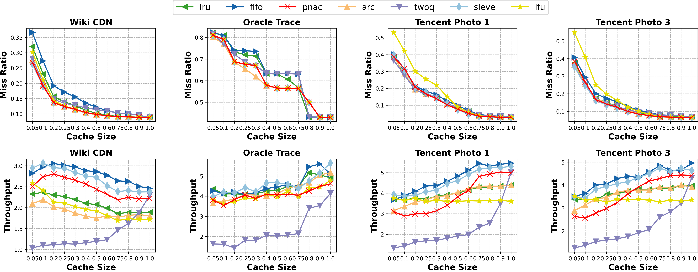

## Weekly Report

更新时间：2025.08.31

## 2025.08.31

近期工作：

+ 在选中数据集上进行更多实验，持续优化 **PNAC** 算法的性能

+ 编写脚本，使用现有实验数据绘制对比算法效果图：[images/result.png](images/result.png)

## 2025.08.10

近期工作：

+ 完成 Tencent Photo 数据集的切分，并使用更多不同数据集进行对比算法之间的性能测试实验

  + 现有数据集：Oracle Trace / Wiki CDN / Meta CDN / Tencent Photo

## 2025.07.27

近期工作：

+ 使用 **LibCacheSim** 给出的参考数据集，进行 **PNAC** 与对比算法之间的性能测试实验；并基于实验结果优化算法，收集实验数据至：[data/](data/)

  + 对比算法：PNAC / LRU / FIFO / ARC / TwoQ / SIEVE / LFU
  
  + 数据集：Oracle Trace / Wiki CDN / Meta CDN

## 2025.07.06

本周工作：

+ 实现 **PNAC** 算法至 **LibCacheSim** 框架中，并在测试数据集上跑通

+ 编写自动运行多次实验并收集数据的脚本，初步搭建起实验 demo

## 2025.06.29

本周工作：

+ 将 **LibCacheSim** 实验环境部署至本地并跑通测试数据集

+ 阅读 **LibCacheSim** 框架代码，掌握如何添加新的 Cache 算法类型 

+ 结合会议内容与专利书理解 **PNAC** 算法的运行逻辑、数据结构功能等

## 2025.04.20

本周工作：

+ 完成 **Periodic Sketch** 论文 Intro 与 Related Work 部分的精读，并整理论文笔记至：[Thesis Notes](docs/ThesisNotes.md)
  