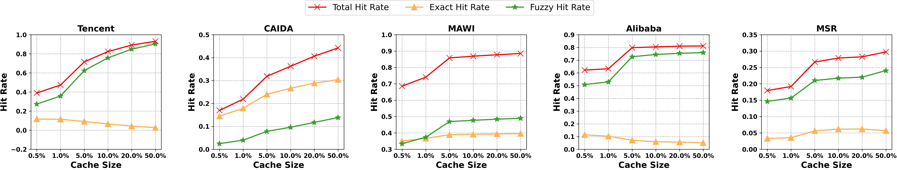
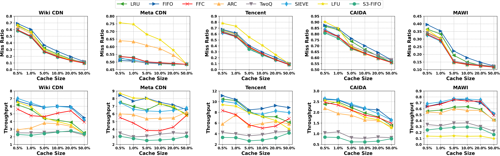
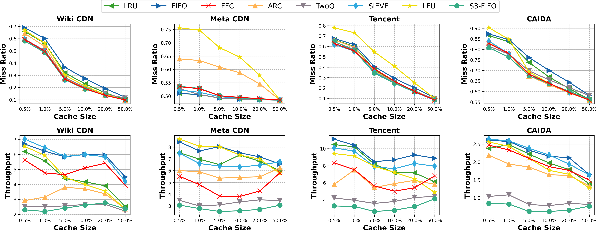
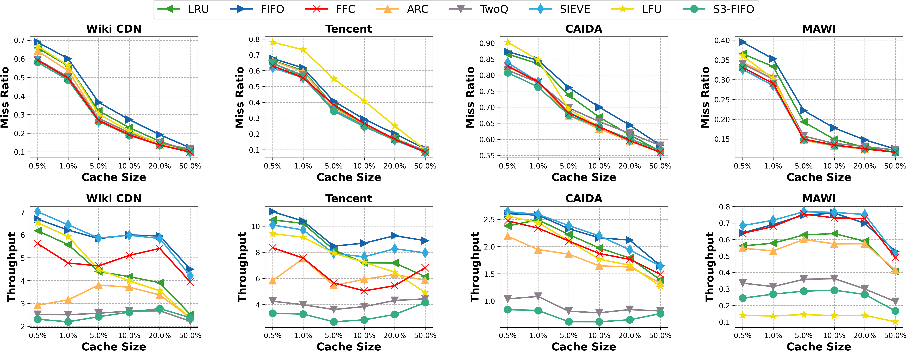
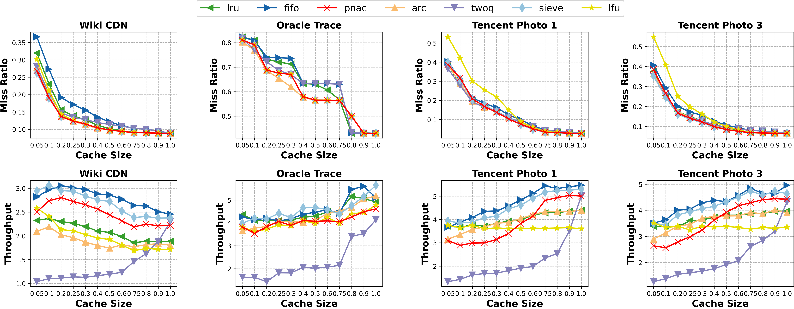

## Weekly Report

更新时间：2025.11.23

## 2025.11.23

近期工作：

+ 学习 P4 语言基本知识，并整理学习笔记至：[docs/P4Lang.md](docs/P4Lang.md)

+ 在本地配置基于 P4C / PI / BMv2 / MiniNet 的 P4 代码运行环境

## 2025.09.21

近期工作：

+ 编写脚本，自动运行不同缓存比例 / 数据集配置下的精确 / 模糊命中率实验

+ 编写脚本，绘制各数据集总命中率 / 精确命中率 / 模糊命中率的对比效果图

+ 在更多数据集上进行实验并收集结果，选取表现较优的数据集用于绘制最终图表

绘制结果：

+ 数据集：Tencent / CAIDA / MAWI / Alibaba / MSR

+ 原图链接：[images/exact_fuzzy.png](images/exact_fuzzy.png)

## 2025.09.07

近期工作：

+ 额外引入 S3-FIFO 作为对比算法，在候选数据集上进行实验并收集结果 

+ 添加 CAIDA / MAWI 作为候选数据集，并跑出所有对比算法的性能表现

+ 按照要求，重新绘制各缓存算法的对比效果图

+ 整理实验环境配置 & 算法配置文档：[docs/Environment.md](docs/Environment.md)

绘制结果：

+ 数据集：Wiki CDN / Meta CDN / Tencent / CAIDA / MAWI

+ 原图链接：[images/mrtp_final.png](images/mrtp_final.png)

+ 数据集：Wiki CDN / Meta CDN / Tencent / CAIDA 

+ 原图链接：[images/mrtp_meta.png](images/mrtp_meta.png)

+ 数据集：Wiki CDN / Tencent / CAIDA / MAWI 

+ 原图链接：[images/mrtp_mawi.png](images/mrtp_mawi.png)

## 2025.08.31

近期工作：

+ 在选中数据集上进行更多实验，持续优化 **PNAC** 算法的性能

+ 编写脚本，使用现有实验数据绘制对比算法效果图：[images/mrtp_trial.png](images/mrtp_trial.png)

## 2025.08.10

近期工作：

+ 完成 Tencent Photo 数据集的切分，并使用更多不同数据集进行对比算法之间的性能测试实验

  + 现有数据集：Oracle Trace / Wiki CDN / Meta CDN / Tencent Photo

## 2025.07.27

近期工作：

+ 使用 **LibCacheSim** 给出的参考数据集，进行 **PNAC** 与对比算法之间的性能测试实验；并基于实验结果优化算法，收集实验数据至：[data/](data/)

  + 对比算法：PNAC / LRU / FIFO / ARC / TwoQ / SIEVE / LFU
  
  + 数据集：Oracle Trace / Wiki CDN / Meta CDN

## 2025.07.06

本周工作：

+ 实现 **PNAC** 算法至 **LibCacheSim** 框架中，并在测试数据集上跑通

+ 编写自动运行多次实验并收集数据的脚本，初步搭建起实验 demo

## 2025.06.29

本周工作：

+ 将 **LibCacheSim** 实验环境部署至本地并跑通测试数据集

+ 阅读 **LibCacheSim** 框架代码，掌握如何添加新的 Cache 算法类型 

+ 结合会议内容与专利书理解 **PNAC** 算法的运行逻辑、数据结构功能等

## 2025.04.20

本周工作：

+ 完成 **Periodic Sketch** 论文 Intro 与 Related Work 部分的精读，并整理论文笔记至：[Thesis Notes](docs/ThesisNotes.md)
  